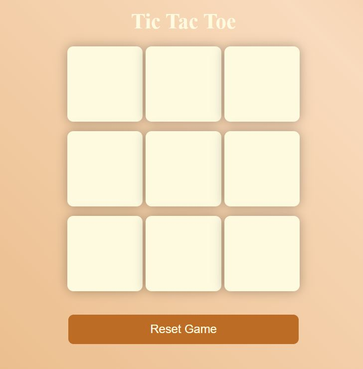
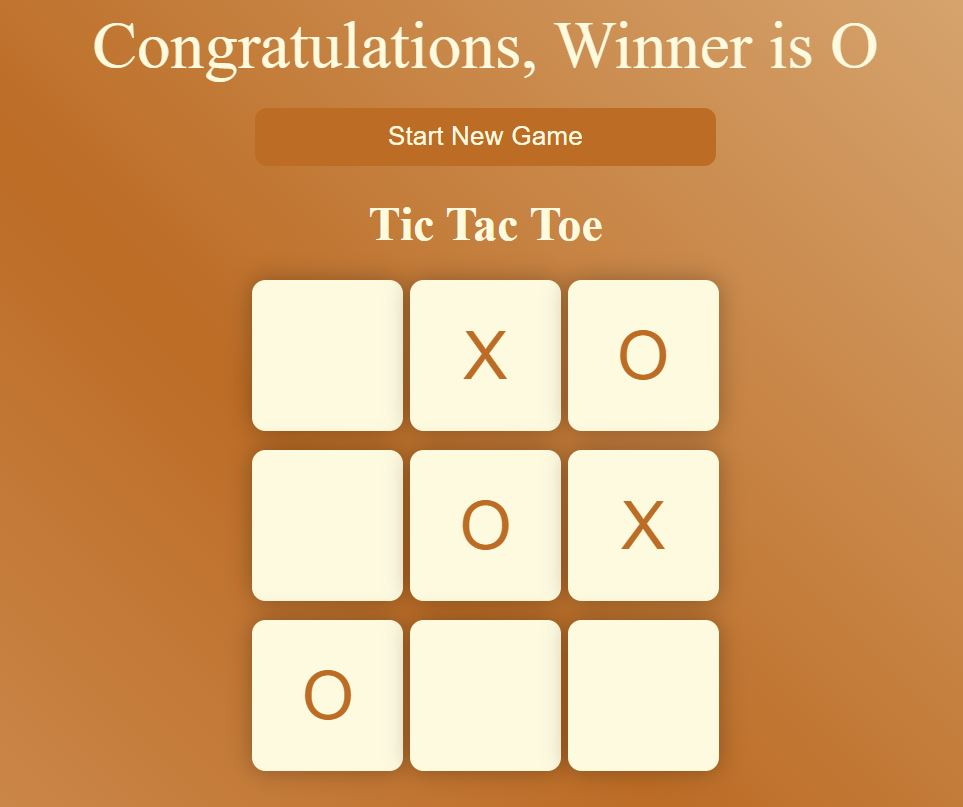

# Tic Tac Toe Game

This project is a simple but visually appealing implementation of the classic Tic Tac Toe game. It's built with HTML, CSS, and JavaScript, featuring a dynamic gradient background that enhances the user experience.

#### Web Design Preview



## Table of Contents

- [Live Demo](#live-demo)
- [Features](#features)
- [Technologies Used](#technologies-used)
- [Project Structure](#project-structure)
- [How to Play](#how-to-play)
- [Getting Started](#getting-started)

## Live Demo

You can play the game right now by visiting the following link: [Play Tic Tac Toe](https://mehwishjbe.github.io/tic-tac-toe/).

## Features

- **Interactive Tic Tac Toe Gameplay:** Play against a friend on the same device, taking turns to mark your symbols on the grid.
- **Dynamic Gradient Background:** The game features a beautiful, animated gradient background that shifts colors, adding a vibrant and dynamic feel to the gameplay.
- **Responsive Design:** The game is fully responsive and can be played on devices of various sizes, ensuring a great experience on both desktops and mobile devices.
- **Game Reset Functionality:** Easily start a new game or reset the current game at any point using the provided buttons.

## Technologies Used

This project utilizes the following technologies:

- **HTML**: Structures the game's content.
- **CSS**: Styles the game's appearance, including the dynamic gradient background.
- **JavaScript**: Provides the game's interactivity, logic, and controls.

## Project Structure

The project's file structure is straightforward and consists of the following main files:

- `index.html`: The main HTML document that contains the structure of the game.
- `style.css`: Contains all the CSS styles for the game, including the animation for the gradient background.
- `script.js`: Contains the JavaScript logic for game functionality, such as player turns, win conditions, and resetting the game.

## How to Play

1. The game starts with Player 1 using the "O" symbol and Player 2 using the "X" symbol.
2. Players take turns clicking on the empty squares to place their symbol.
3. The first player to get 3 of their symbols in a row (vertically, horizontally, or diagonally) is the winner.
4. If all squares are filled and no player has 3 symbols in a row, the game is a draw.
5. Use the "Start New Game" or "Reset Game" button to begin a new game at any time.

## Getting Started

To get a local copy up and running, follow these simple steps:

1. Clone the repository to your local machine:
   ```bash
   git clone https://github.com/mehwishjbe/tic-tac-toe.git
